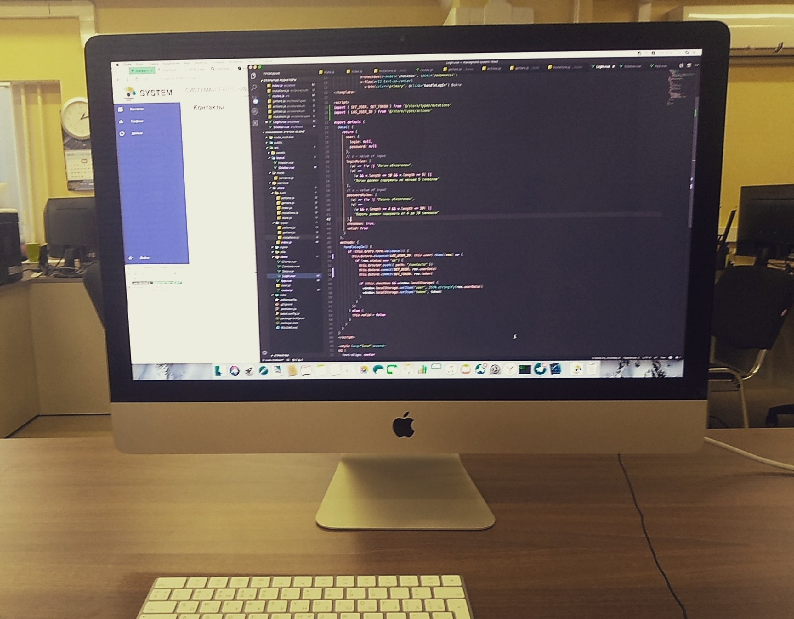

В этой статье дам небольшой экскурс в сферу IT, рассмотрю плюсы и минусы различных подходов к обучению программированию, a в конце поведую о своем опыте и о том, куда этот опыт меня привëл.

## Небольшой ликбез
Начнëм с того, что сфера разработки слишком обширна, чтобы описывать каждую её составляющую по отдельности. Для простого обывателя (к коим я отношу и себя) важно понимать, что человек, который «пишет сайты», не пойдет разрабатывать программное обеспечение в SpaceX, a аналитик данных в банке не занимается поддержкой серверов и т. п.

На самом деле, все они получили «плюс минус» одинаковые начальные знания (у всех ведь были уроки информатики), но в какой-то момент выбрали определённое направление и  продолжили развиваться внутри него. Популярный анекдот среди разработчиков: «Почини компьютер, ты же программист!» – отчасти про то, что людям свойственно обобщать всех под одну стезю.

К тому же каждая сфера требует свой список сильных сторон от программиста. К примеру, в GameDev никуда без физики, а Data Science это фактически методы линейной алгебры в коде. Объединяет всех программистов одно (наверное, вы уже догадались) – технический склад ума. Так уж интересно заведено природой, человеку от рождения даётся либо одно, либо другое, и почти никогда вместе (у меня по этому поводу есть некоторые суждения, но это тема для другой статьи).

Пару слов о масштабах IT. Всем, конечно, известны корпорации Google, Facebook, Adobe, Microsoft и наши российские аналоги: Yandex, VK и т. д. В них работают тысячи программистов в сотнях офисах по всему миру. Но что меня удивило, когда я только погружался в данную сферу, так это то, что даже в компаниях, которые не позиционируют себя айтишными, отделы разработчиков зачастую занимают большую часть от общего количества работников. Ходил на экскурсию в Леруа Мерлен – там 5 этажей офисов различных продуктовых команд. Или же в Авито: вроде бы один сайт – ан нет, около полусотни команд от 5 до 10 человек. И эта тенденция наблюдается во всем мире, поэтому, если услышите, что мол: «программисты, станут не востребованы подобно экономистам в 2000-х», - не верьте.

*Не стоит думать, что в IT только мужчины, для девушек также открыты все двери.*

## С чего начать?
Предположим, что моя реклама IT сферы на кого-то подействовала, и теперь стоит вопрос: «с чего же начать и стоит ли вообще?». Тут на первый план выходят открытость, доступность и прозрачность сферы. Начинающему разработчику абсолютно не нужно академическое образование для вхождения в сферу; всё необходимое, чтобы устроиться на первую работу, есть в открытом доступе в интернете. Второй вариант – это платные курсы. Да я о тех, которые за N-ое количество времени собираются обучить вас профессии.

Очевидные минусы самостоятельного обучения (self taught): зачастую отсутствие структурирования знаний и сложность сохранения мотивации в течении всего времени изучения, а это обычно 0,5 – 1,5 года. Минус курсов – возможное несовпадение качества преподавания и ваших ожиданий. В любом случае оба варианта требуют полной самоотдачи и большого количества практики. Тут не забудем к техническому складу ума добавить базовые знание английского или хотя бы отсутствие природной отвергаемости к нему.

Кто-то может спросить: «а зачем же люди обучаются на программистов в университетах?». Действительно, люди с высшим профильным образованием, как и в других сферах жизнедеятельности, в IT ценятся. Но мне кажется, идти получать CS (computer science) образование нужно, во-первых, если у вас есть желание вести исследовательскую деятельность, во-вторых, если вы определились со сферой или даже компанией и точно знаете, что там никуда без университетских знаний или диплома. Самым наглядным примером является сфера анализа данных (data science), которую крайне проблематично освоить самостоятельно. От себя добавлю: «а где гарантия, что в институте вам не отобьют любовь к программированию?».

## О своем опыте
Я, программист-самоучка, второй месяц работаю фронтенд-разработчиком в компании IT Софт. Пишу код и перенимаю опыт у коллег, сидя в удобном офисе в центре Москвы. А все начиналось с уроков информатики, где вроде бы интересно было писать циклы и условия на Pascal, но никто не объяснял - а что дальше–то, какую практическую пользу принесет код, который я сперва нажму скомпилировать (Compile), а затем запущу (Run).

В итоге поступил на электроэнергетика, тут и любимая физика, и вроде бы все понятно. Уже на 1-2 курсах, помогая однокурсникам с заданиями по той же информатике, у меня появилось желание поподробнее разобраться, как же устроена сфера разработки. Сперва познакомился с языком программирования Python, но, не почувствовав к нему симпатии, решил с головой уйти в веб; и на данный момент вижу именно это направление разработки своим основным занятием в будущем.

*Мое рабочее место. iMac - огонь!*

Что меня привлекает в веб-разработке:
* Это постоянно развивающаяся сфера
* Возможность релокации или удаленной работы
* Активное комьюнити (чаты, митапы, конференции)
* Высокие зарплаты (как и во всей сфере IT)
* Прозрачная карьерная лестница – младший разработчик, старший разработчик, руководитель команды, руководитель отдела, директор
* Корпоративная политика компаний

Закончу цитатой [Лао-цзы](https://ru.wikiquote.org/wiki/%D0%9B%D0%B0%D0%BE-%D1%86%D0%B7%D1%8B): «Путь в тысячу миль начинается с одного шага».

*Спасибо за прочтение!*